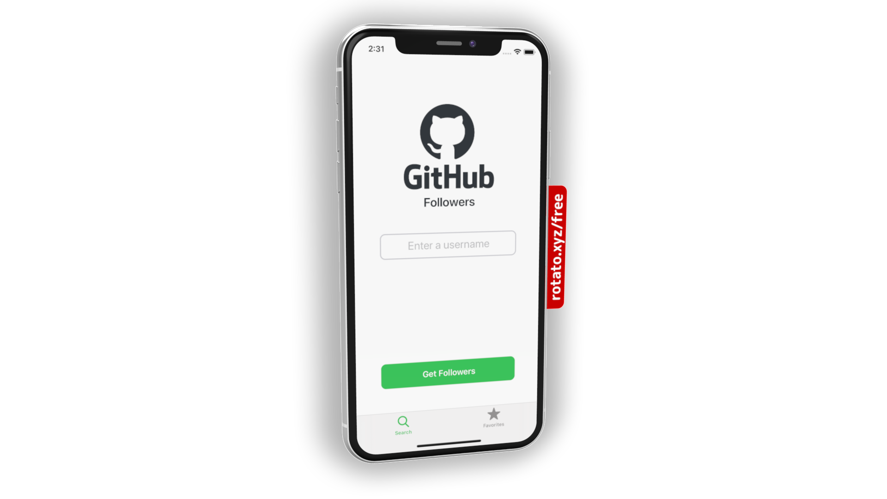
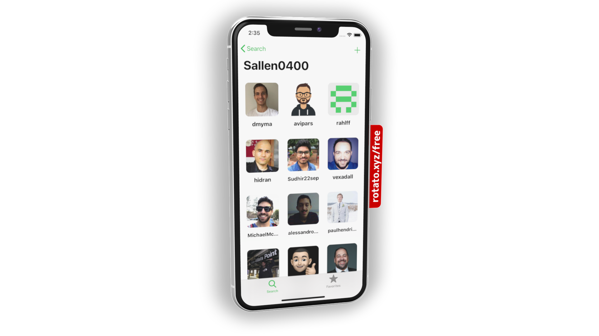
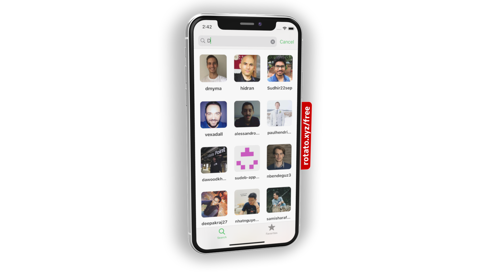
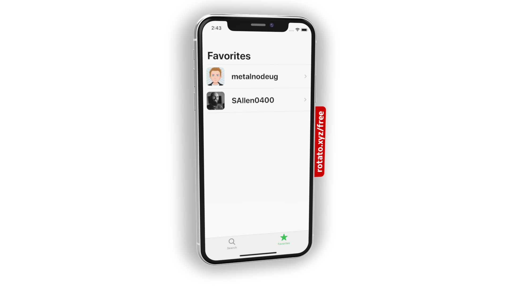
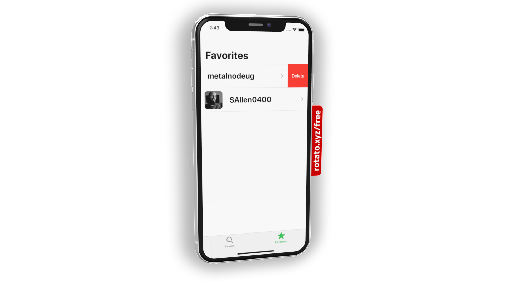

# GHFollowers

The source code for this project is based on Swift course [iOS Dev Job Interview Practice - Take Home Project](https://seanallen.teachable.com/p/take-home) by [Sean Allen](https://github.com/SAllen0400)

The app does not use any third party libraries and builds UI 100% programmatically with UIKit.

    

 

## What does the app do?
- Search for a GitHub accounts followers
- View each followers user information
- Save and store your favorite GitHub users locally

## What did the course cover?
- Custom Alerts
- Custom UI Elements
- Programmatic UI 100%
- Creating project with no storyboard
- Child View Controllers
- Animations
- Delegate & Protocol
- Networking and Persistence with "UserDefaults"
- Swift features such as Result type and Variadic Parameters

## Where can I get the course?
[https://seanallen.teachable.com](https://seanallen.teachable.com)
